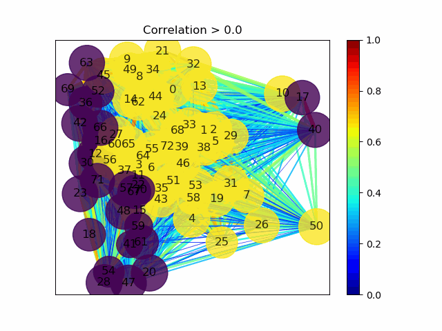

# Neuronal_network_analysis_1.0
Scripts to analyze neuronal network activity in Python based on Duan, Che, Chu et al., 2019 Neuron (https://www.sciencedirect.com/science/article/pii/S0896627319308566?via%3Dihub). Strategy to detect neuronal assemblies used here was developed in the Cossart Lab (http://www.inmed.fr/en/developpement-des-microcircuits-gabaergiques-corticaux-en)

-Requires inputs in spreadsheet format (.csv) with rows representing cells and columns representing time (movie frames). easily obtainable without programming experience from 2p calcium imaging movies analyzed with ezcalcium (https://porteralab.dgsom.ucla.edu/pages/matlab). 

-.mat script included allows extraction of spatial coordinates of each cell from matlab after ezcalcium run (using weighted centroids as location). outputs into a .csv file accepted by the included script.

Instructions:
-Put all files into same folder and run calcium_imaging_module_run. set the directories and other settings as desired.

-network_plot_plotly_interactive plots a sliding bar that scales the correlation coefficient between the cells in the network. Can be run in isolation. Useful for visualizing subnetworks.  

-network_plot_plotly_activityflow plots activity over time using a sliding bar. also useful for visualizing subnetworks and activity flow. requires calcium_imaging_module_run be run first. 

